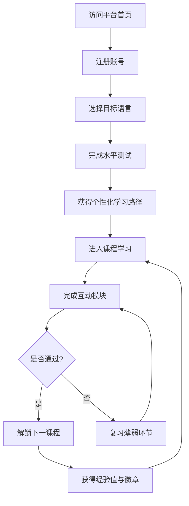
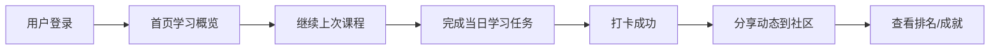

## 1. 产品概述

LinguaLearn 是一款面向全球语言学习者的沉浸式多语种在线教育平台，覆盖英语、法语、西班牙语、俄语、德语五种主流语言。平台通过分级课程体系、互动式学习模块、智能进度追踪与个性化推荐，打造系统化且有趣的语言学习体验。

- **核心目标**：为学习者提供从入门到精通的完整语言学习路径，融合听说读写全方位训练。
- **目标用户**：零基础至中高级的语言学习者，包括学生、职场人士及语言爱好者。
- **市场价值**：通过社区交流与成就激励增强用户粘性，构建可持续的语言学习生态。

## 2. 核心功能

### 2.1 用户角色

| 角色 | 注册方式 | 核心权限 |
|------|----------|----------|
| 普通用户 | 邮箱注册 / 用户名密码登录 | 浏览课程、学习模块、查看进度、社区互动 |
| 管理员 | 后台设定 | 管理课程内容、审核社区内容 |

### 2.2 功能模块

1. **用户认证系统**：注册、登录、个人信息管理
2. **首页**：Hero 横幅、语言选择、课程推荐、学习数据概览
3. **分级课程体系**：按语言和等级（A1-C2）组织的课程列表与详情
4. **互动学习模块**：单词记忆（闪卡）、语法练习（选择题/填空）、听力训练（音频+题目）、口语跟读（录音对比）
5. **学习进度追踪**：学习统计、连续打卡、课程完成度、可视化进度面板
6. **个性化推荐**：基于学习行为和水平的智能课程推荐
7. **社区交流**：学习动态分享、讨论区、点赞评论
8. **成就激励系统**：徽章、积分、等级、排行榜

### 2.3 页面详情

| 页面名称 | 模块名称 | 功能描述 |
|----------|----------|----------|
| 注册页 | 注册表单 | 邮箱、用户名、密码注册，表单验证 |
| 登录页 | 登录表单 | 邮箱/用户名+密码登录，记住我功能 |
| 首页 | Hero区 | 大标题、副标题、CTA按钮、动态背景动画 |
| 首页 | 语言选择卡片 | 五种语言卡片，含国旗图标、课程数量、等级范围 |
| 首页 | 推荐课程区 | 基于用户水平的推荐课程横向滚动列表 |
| 首页 | 学习概览卡片 | 今日学习时长、连续打卡天数、已掌握单词数 |
| 课程列表页 | 筛选栏 | 按语言、等级（A1-C2）、类型筛选 |
| 课程列表页 | 课程卡片列表 | 课程封面、标题、难度标签、完成进度、评分 |
| 课程详情页 | 课程介绍 | 课程大纲、学习目标、课时列表 |
| 课程详情页 | 开始学习按钮 | 进入学习模式入口 |
| 单词记忆页 | 闪卡互动 | 正面单词/背面释义，翻转动画，标记"已掌握"/"再复习" |
| 单词记忆页 | 进度指示器 | 当前进度、剩余单词数、正确率 |
| 语法练习页 | 题目区 | 选择题/填空题，即时反馈正确/错误，答案解析 |
| 语法练习页 | 得分面板 | 总分、正确率、完成题目数 |
| 听力训练页 | 音频播放器 | 自定义播放控件、倍速、重播 |
| 听力训练页 | 题目作答区 | 听音选词/填空/问答，提交后显示答案 |
| 口语跟读页 | 录音区 | 录音按钮、波形可视化、播放原音/自己录音 |
| 口语跟读页 | 评分反馈 | 发音准确度、流利度、完整度评分 |
| 学习进度页 | 数据面板 | 总学习时长、连续打卡、课程完成统计 |
| 学习进度页 | 图表可视化 | 周/月学习时长趋势图、各语言学习分布 |
| 学习进度页 | 成就展示 | 已解锁徽章、下一个目标徽章 |
| 社区页 | 动态流 | 学习动态卡片列表、点赞、评论 |
| 社区页 | 排行榜 | 周积分排行、总积分排行 |
| 个人中心 | 个人信息 | 头像、昵称、学习等级、总积分 |
| 个人中心 | 学习路径 | 个性化推荐的下阶段课程、学习建议 |

## 3. 核心流程

### 3.1 新用户学习流程

### 3.2 日常学习打卡流程

## 4. 用户界面设计

### 4.1 设计风格

- **主题色调**：深色模式为主基调（深蓝灰 `#0f172a` 背景），搭配温暖的金色（`#f59e0b`）与翡翠绿（`#10b981`）作为强调色，营造专业、沉浸且富有活力的学习氛围。
- **字体选择**：标题使用优雅的衬线字体 `Playfair Display`，正文使用清晰的无衬线字体 `Source Sans 3`，兼具美感与可读性。
- **按钮风格**：柔和圆角（12px），主按钮金色渐变带微光效果，悬停时上浮阴影动画。
- **布局风格**：卡片式布局为主，配合玻璃态效果（glassmorphism），侧边导航栏固定。
- **图标风格**：使用 Lucide Icons 线性图标，统一 1.5px 描边，配合品牌色。

### 4.2 页面设计概览

| 页面名称 | 模块名称 | UI 元素 |
|----------|----------|---------|
| 首页 | Hero区 | 全屏背景（粒子动画+渐变），大标题居中，CTA按钮带光晕，向下滚动提示箭头 |
| 首页 | 语言选择卡片 | 圆角卡片，玻璃态背景，国旗emoji+语言名，悬停上浮+边框发光效果 |
| 首页 | 学习概览卡片 | 三列网格卡片，数字大字体突出，图标点缀，连续打卡火焰动画 |
| 课程列表页 | 筛选栏 | 横向标签式筛选，选中态金色下划线，平滑过渡动画 |
| 课程列表页 | 课程卡片 | 纵向卡片，封面图渐变遮罩，难度标签彩色圆点，进度条 |
| 单词记忆页 | 闪卡 | 3D翻转动画，正面简洁单词+音标，背面释义+例句，底部操作按钮 |
| 语法练习页 | 题目卡片 | 题目居中大卡片，选项列表，正确/错误即时颜色反馈动画 |
| 听力训练页 | 音频播放器 | 波形可视化进度条，自定义播放控件，半透明深色面板 |
| 口语跟读页 | 录音区 | 居中圆形录音按钮，脉冲动画，波形实时显示 |
| 学习进度页 | 数据面板 | 统计卡片+图表，使用 recharts 折线图/柱状图 |
| 社区页 | 动态卡片 | 头像+用户名+内容，点赞评论图标，类似社交媒体信息流 |

### 4.3 响应式设计

- 桌面端优先（1280px+），采用侧边导航栏布局。
- 平板端（768px-1279px）：侧边栏折叠为顶部汉堡菜单，卡片网格从3列变为2列。
- 移动端（<768px）：单列布局，底部固定导航栏，卡片全宽显示。
- 触控优化：按钮最小触控区域 44x44px，滑动操作支持。

## 5. 数据方案

平台采用前端 Mock 数据 + 后端 Express API 的混合方案。用户认证、进度追踪等核心数据通过后端 API 持久化到 SQLite 数据库；课程内容、单词库等静态数据以前端 JSON 文件形式管理，便于内容更新。