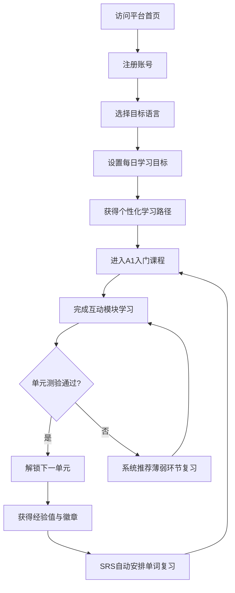
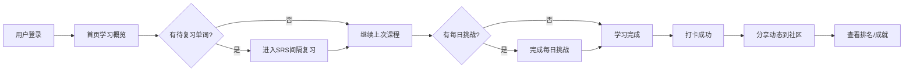
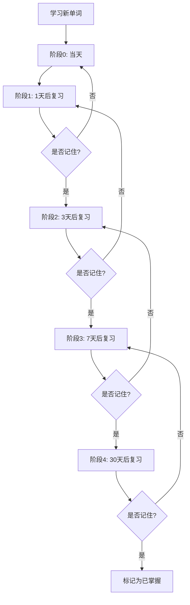

## 1. 产品概述

LinguaLearn 是一款面向全球语言学习者的沉浸式多语种在线教育平台，覆盖英语、法语、西班牙语、俄语、德语五种主流语言。平台通过分级课程体系、互动式学习模块、智能进度追踪与个性化推荐，打造系统化且有趣的语言学习体验。

- **核心目标**：为学习者提供从入门到精通的完整语言学习路径，融合听说读写全方位训练，支持每日挑战、间隔复习、发音评估等高级功能。
- **目标用户**：零基础至中高级的语言学习者，包括学生、职场人士及语言爱好者。
- **市场价值**：通过社区交流与成就激励增强用户粘性，构建可持续的语言学习生态。

## 2. 核心功能

### 2.1 用户角色

| 角色 | 注册方式 | 核心权限 |
|------|----------|----------|
| 普通用户 | 邮箱注册 / 用户名密码登录 | 浏览课程、学习模块、查看进度、社区互动、个性化推荐 |
| 管理员 | 后台设定 | 管理课程内容、审核社区内容、查看平台数据统计 |

### 2.2 功能模块

1. **用户认证系统**：注册、登录、个人信息管理、密码重置、头像上传
2. **首页**：Hero 横幅、语言选择、课程推荐、学习数据概览、每日挑战入口
3. **分级课程体系**：按语言和 CEFR 等级（A1-C2）组织的课程列表与详情，每门课程包含多个单元课时
4. **互动学习模块**：
   - **单词记忆**（闪卡 + 间隔复习）：正面单词/背面释义，翻转动画，根据艾宾浩斯遗忘曲线智能推送复习
   - **语法练习**（选择题/填空/排序）：即时反馈，错题自动收集到复习队列
   - **听力训练**（音频+多题型）：短文听写、对话理解、听音选词
   - **口语跟读**（录音+发音评估）：波形可视化，发音准确度、流利度、完整度三维修分
5. **每日挑战**：每日刷新一组限时挑战任务（单词、语法、听力混合），完成后获得额外经验奖励
6. **学习进度追踪**：学习统计、连续打卡、课程完成度、可视化进度面板、学习时长趋势图
7. **间隔复习系统（SRS）**：基于艾宾浩斯记忆曲线的智能单词复习推送，自动安排复习间隔（1天、3天、7天、30天）
8. **个性化推荐**：基于用户当前水平、薄弱环节和学习偏好，智能推荐下一阶段课程
9. **社区交流**：学习动态分享、讨论区、点赞评论、关注其他学习者
10. **成就激励系统**：徽章、经验值、等级、排行榜（周榜/总榜）
11. **主题切换**：支持深色/浅色主题切换，用户偏好持久化
12. **学习提醒**：用户可设置每日学习提醒时间

### 2.3 页面详情

| 页面名称 | 模块名称 | 功能描述 |
|----------|----------|----------|
| 注册页 | 注册表单 | 邮箱、用户名、密码注册，表单验证，密码强度指示器 |
| 登录页 | 登录表单 | 邮箱+密码登录，记住我功能，错误提示 |
| 首页 | Hero区 | 大标题、副标题、CTA按钮、动态粒子背景动画 |
| 首页 | 语言选择卡片 | 五种语言卡片，含国旗图标、课程数量、等级范围 |
| 首页 | 每日挑战卡片 | 今日挑战任务预览，经验奖励，完成进度 |
| 首页 | 推荐课程区 | 基于用户水平的推荐课程横向滚动列表 |
| 首页 | 学习概览卡片 | 今日学习时长、连续打卡天数、已掌握单词数、总经验值 |
| 首页 | 待复习提醒 | SRS间隔复习待处理数量，一键进入复习 |
| 课程列表页 | 筛选栏 | 按语言、等级（A1-C2）、排序方式筛选 |
| 课程列表页 | 课程卡片列表 | 课程封面、标题、难度标签、课时数、完成进度、评分 |
| 课程详情页 | 课程介绍 | 课程大纲、学习目标、单元列表、课时列表 |
| 课程详情页 | 开始学习/继续学习 | 进入学习模式入口，显示上次学习位置 |
| 单词记忆页 | 闪卡互动 | 正面单词/背面释义/例句，翻转动画，标记"已掌握"/"再复习" |
| 单词记忆页 | 进度指示器 | 当前进度、剩余单词数、正确率、session统计 |
| 单词记忆页 | SRS状态 | 显示每个单词的记忆曲线阶段 |
| 语法练习页 | 题目区 | 选择题/填空题/排序题，即时反馈正确/错误，答案解析 |
| 语法练习页 | 得分面板 | 总分、正确率、完成题目数，错题回顾 |
| 听力训练页 | 音频播放器 | 自定义播放控件、倍速(0.5x-2x)、进度拖拽、重播 |
| 听力训练页 | 题目作答区 | 听音选词/填空/听写，提交后显示正确答案对比 |
| 口语跟读页 | 录音区 | 录音按钮、波形可视化、播放原音/自己录音、对比播放 |
| 口语跟读页 | 评分反馈 | 发音准确度、流利度、完整度三维修分雷达图 |
| 每日挑战页 | 挑战任务列表 | 混合题型任务，倒计时，实时得分 |
| 每日挑战页 | 结算面板 | 挑战完成总结，经验奖励动画 |
| 学习进度页 | 数据面板 | 总学习时长、连续打卡、课程完成统计、经验值趋势 |
| 学习进度页 | 图表可视化 | 周/月学习时长趋势折线图、各语言学习分布饼图 |
| 学习进度页 | 单词复习日历 | 热力图展示每日复习单词数量 |
| 学习进度页 | 成就展示墙 | 已解锁徽章展示，灰色未解锁徽章预览 |
| 社区页 | 动态流 | 学习动态卡片列表、点赞、评论、关注按钮 |
| 社区页 | 排行榜 | 周积分排行/总积分排行 Tab 切换 |
| 个人中心 | 个人信息 | 头像、昵称、学习等级进度条、总积分、加入日期 |
| 个人中心 | 设置面板 | 目标语言、每日学习目标、学习提醒时间、主题切换 |
| 个人中心 | 学习路径 | 个性化推荐的下阶段课程列表、学习建议 |

## 3. 核心流程

### 3.1 新用户入门流程

### 3.2 日常学习打卡流程

### 3.3 间隔复习流程

## 4. 用户界面设计

### 4.1 设计风格

- **主题色调**：
  - 深色模式：深蓝灰 `#0f172a` 背景，温暖的金色（`#f59e0b`）与翡翠绿（`#10b981`）作为强调色
  - 浅色模式：柔和米白 `#faf9f6` 背景，深蓝 `#1e3a5f` 与珊瑚橙 `#e07a5f` 作为强调色
- **字体选择**：标题使用优雅的衬线字体 `Playfair Display`，正文使用清晰的无衬线字体 `Source Sans 3`，兼具美感与可读性。
- **按钮风格**：柔和圆角（12px），主按钮渐变带微光效果，悬停时上浮阴影动画。
- **布局风格**：卡片式布局为主，配合玻璃态效果（glassmorphism），侧边导航栏固定。
- **图标风格**：使用 Lucide Icons 线性图标，统一 1.5px 描边，配合品牌色。

### 4.2 页面设计概览

| 页面名称 | 模块名称 | UI 元素 |
|----------|----------|---------|
| 首页 | Hero区 | 全屏背景（粒子动画+渐变），大标题居中，CTA按钮带光晕，向下滚动提示箭头 |
| 首页 | 语言选择卡片 | 圆角卡片，玻璃态背景，国旗emoji+语言名，悬停上浮+边框发光效果 |
| 首页 | 每日挑战卡片 | 火焰图标+挑战标题，任务进度条，经验奖励数字动画 |
| 首页 | 学习概览卡片 | 四列网格卡片，数字大字体突出，连续打卡火焰动画，学习时长时钟图标 |
| 课程列表页 | 筛选栏 | 横向标签式筛选，选中态金色下划线，平滑过渡动画 |
| 课程列表页 | 课程卡片 | 纵向卡片，封面图渐变遮罩，CEFR等级标签彩色圆点，进度条 |
| 单词记忆页 | 闪卡 | 3D翻转动画，正面单词+音标+发音按钮，背面释义+例句+词性标签 |
| 单词记忆页 | SRS状态指示 | 每个单词的记忆阶段圆点指示器 |
| 语法练习页 | 题目卡片 | 题目居中大卡片，选项列表，正确/错误即时颜色反馈+震动动画 |
| 听力训练页 | 音频播放器 | 波形可视化进度条，倍速选择器，半透明深色面板 |
| 口语跟读页 | 录音区 | 居中圆形录音按钮带脉冲动画，实时波形显示，评分雷达图 |
| 每日挑战页 | 倒计时 | 顶部倒计时器，每题计时，紧张感设计 |
| 学习进度页 | 数据面板 | 统计卡片+图表，使用 recharts 折线图/柱状图/饼图 |
| 学习进度页 | 复习日历 | GitHub风格热力图，颜色深度表示复习量 |
| 社区页 | 动态卡片 | 头像+用户名+内容，点赞/评论/关注图标，类似社交媒体信息流 |

### 4.3 响应式设计

- 桌面端优先（1280px+），采用侧边导航栏布局。
- 平板端（768px-1279px）：侧边栏折叠为顶部汉堡菜单，卡片网格从4列变为2列。
- 移动端（<768px）：单列布局，底部固定导航栏，卡片全宽显示。
- 触控优化：按钮最小触控区域 44x44px，滑动操作支持。

## 5. 数据方案

所有数据均从 SQLite 数据库获取，通过 Next.js API Routes 提供 RESTful 接口。课程内容、单词库、语法题库、听力素材等教学数据均预置在数据库中，不再使用前端 Mock 数据。