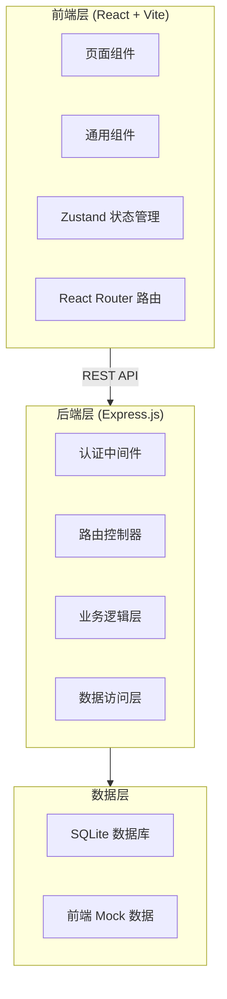
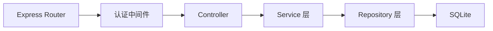
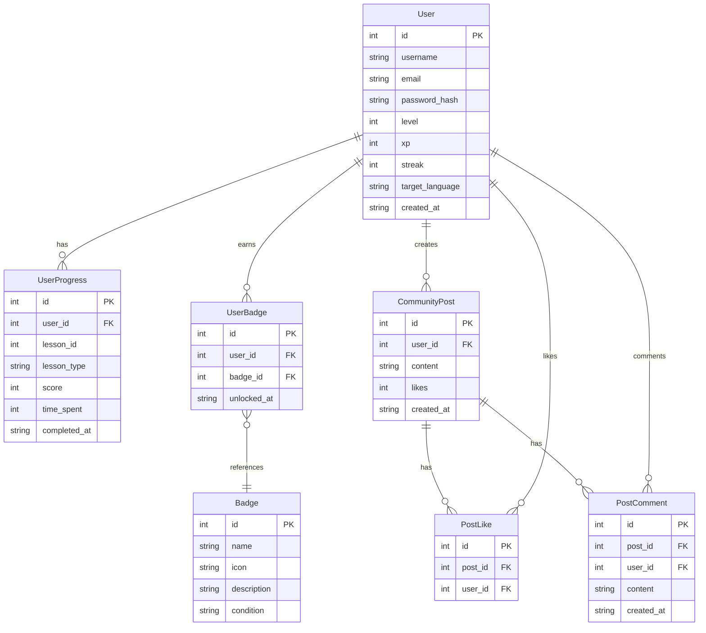

## 1. 架构设计



## 2. 技术选型

- **前端**：React@18 + TypeScript + TailwindCSS@3 + Vite
- **状态管理**：Zustand
- **路由**：React Router DOM v6
- **图表**：Recharts
- **图标**：Lucide React
- **HTTP 客户端**：Fetch API（原生）
- **后端**：Express@4 + TypeScript
- **数据库**：better-sqlite3（轻量级，无需额外安装数据库服务）
- **认证**：JWT（JSON Web Token）+ bcryptjs 密码加密
- **初始化工具**：vite-init (react-express-ts 模板)

## 3. 路由定义

| 路由 | 页面 | 说明 |
|------|------|------|
| `/` | 首页 | Hero区 + 语言选择 + 推荐课程 |
| `/login` | 登录页 | 用户登录 |
| `/register` | 注册页 | 用户注册 |
| `/courses` | 课程列表 | 按语言和等级筛选 |
| `/courses/:id` | 课程详情 | 课程大纲与课时 |
| `/learn/word/:lessonId` | 单词记忆 | 闪卡互动学习 |
| `/learn/grammar/:lessonId` | 语法练习 | 选择题与填空题 |
| `/learn/listening/:lessonId` | 听力训练 | 音频播放与作答 |
| `/learn/speaking/:lessonId` | 口语跟读 | 录音与评分 |
| `/progress` | 学习进度 | 统计图表与成就 |
| `/community` | 社区 | 动态流与排行榜 |
| `/profile` | 个人中心 | 用户信息与学习路径 |

## 4. API 定义

### 4.1 认证相关

```typescript
// POST /api/auth/register
interface RegisterRequest {
  username: string;
  email: string;
  password: string;
}
interface RegisterResponse {
  token: string;
  user: { id: number; username: string; email: string; level: number; xp: number; }
}

// POST /api/auth/login
interface LoginRequest {
  email: string;
  password: string;
}
interface LoginResponse {
  token: string;
  user: { id: number; username: string; email: string; level: number; xp: number; }
}

// GET /api/auth/me (需认证)
interface MeResponse {
  user: { id: number; username: string; email: string; level: number; xp: number; streak: number; }
}
```

### 4.2 学习进度相关

```typescript
// GET /api/progress (需认证)
interface ProgressResponse {
  totalHours: number;
  streak: number;
  completedCourses: number;
  weeklyStats: { date: string; minutes: number }[];
  languageStats: { language: string; progress: number }[];
  badges: { id: number; name: string; icon: string; unlockedAt: string }[];
}

// POST /api/progress/update (需认证)
interface ProgressUpdateRequest {
  lessonId: number;
  type: 'word' | 'grammar' | 'listening' | 'speaking';
  score: number;
  timeSpent: number;
}
```

### 4.3 社区相关

```typescript
// GET /api/community/posts?page=1&limit=20
interface PostItem {
  id: number;
  userId: number;
  username: string;
  content: string;
  likes: number;
  comments: number;
  createdAt: string;
}

// POST /api/community/posts (需认证)
interface CreatePostRequest {
  content: string;
}

// GET /api/community/leaderboard
interface LeaderboardItem {
  rank: number;
  userId: number;
  username: string;
  xp: number;
  streak: number;
}
```

## 5. 后端架构



## 6. 数据模型

### 6.1 ER 图



### 6.2 DDL

```sql
CREATE TABLE users (
  id INTEGER PRIMARY KEY AUTOINCREMENT,
  username TEXT NOT NULL UNIQUE,
  email TEXT NOT NULL UNIQUE,
  password_hash TEXT NOT NULL,
  level INTEGER DEFAULT 1,
  xp INTEGER DEFAULT 0,
  streak INTEGER DEFAULT 0,
  target_language TEXT DEFAULT 'english',
  created_at TEXT DEFAULT (datetime('now'))
);

CREATE TABLE user_progress (
  id INTEGER PRIMARY KEY AUTOINCREMENT,
  user_id INTEGER NOT NULL REFERENCES users(id),
  lesson_id INTEGER NOT NULL,
  lesson_type TEXT NOT NULL,
  score INTEGER DEFAULT 0,
  time_spent INTEGER DEFAULT 0,
  completed_at TEXT DEFAULT (datetime('now'))
);

CREATE TABLE badges (
  id INTEGER PRIMARY KEY AUTOINCREMENT,
  name TEXT NOT NULL,
  icon TEXT NOT NULL,
  description TEXT NOT NULL,
  condition TEXT NOT NULL
);

CREATE TABLE user_badges (
  id INTEGER PRIMARY KEY AUTOINCREMENT,
  user_id INTEGER NOT NULL REFERENCES users(id),
  badge_id INTEGER NOT NULL REFERENCES badges(id),
  unlocked_at TEXT DEFAULT (datetime('now'))
);

CREATE TABLE community_posts (
  id INTEGER PRIMARY KEY AUTOINCREMENT,
  user_id INTEGER NOT NULL REFERENCES users(id),
  content TEXT NOT NULL,
  likes INTEGER DEFAULT 0,
  created_at TEXT DEFAULT (datetime('now'))
);

CREATE TABLE post_likes (
  id INTEGER PRIMARY KEY AUTOINCREMENT,
  post_id INTEGER NOT NULL REFERENCES community_posts(id),
  user_id INTEGER NOT NULL REFERENCES users(id),
  UNIQUE(post_id, user_id)
);

CREATE TABLE post_comments (
  id INTEGER PRIMARY KEY AUTOINCREMENT,
  post_id INTEGER NOT NULL REFERENCES community_posts(id),
  user_id INTEGER NOT NULL REFERENCES users(id),
  content TEXT NOT NULL,
  created_at TEXT DEFAULT (datetime('now'))
);

-- 初始徽章数据
INSERT INTO badges (name, icon, description, condition) VALUES
  ('初来乍到', 'rocket', '完成你的第一节课程', 'complete_first_lesson'),
  ('连续打卡7天', 'flame', '连续学习7天', 'streak_7'),
  ('连续打卡30天', 'flame-kindling', '连续学习30天', 'streak_30'),
  ('单词达人', 'book-open', '掌握100个单词', 'master_100_words'),
  ('语法专家', 'check-circle', '完成50道语法题', 'complete_50_grammar'),
  ('听力高手', 'headphones', '完成20次听力训练', 'complete_20_listening'),
  ('口语新星', 'mic', '完成10次口语跟读', 'complete_10_speaking'),
  ('积分收割机', 'trophy', '累计获得1000经验值', 'xp_1000');
```