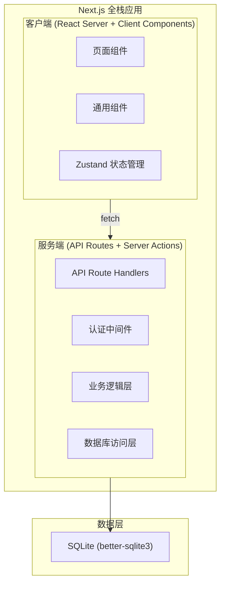
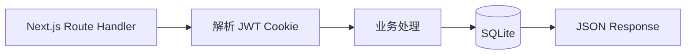
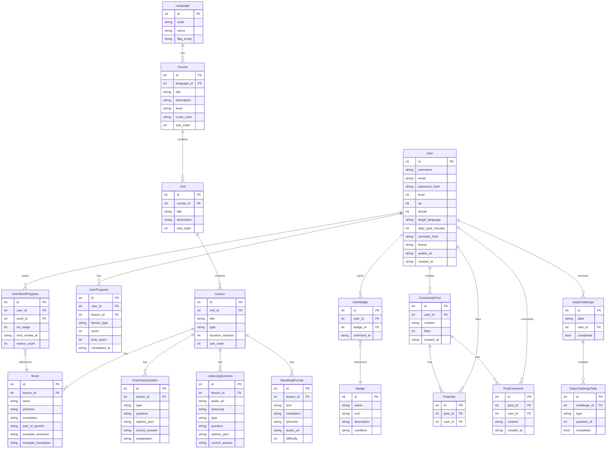

## 1. 架构设计



## 2. 技术选型

- **全栈框架**：Next.js 15 (App Router) + TypeScript
- **UI 样式**：TailwindCSS v4
- **状态管理**：Zustand（客户端全局状态）
- **图表**：Recharts
- **图标**：Lucide React
- **数据库**：better-sqlite3（同步 SQLite 驱动，适配 Next.js）
- **认证**：JWT（jose 库）+ bcryptjs 密码加密，Cookie 存储 token
- **表单验证**：zod
- **HTTP 客户端**：Fetch API（原生）

## 3. 路由定义

| 路由 | 页面 | 类型 | 说明 |
|------|------|------|------|
| `/` | 首页 | Server + Client | Hero + 语言选择 + 每日挑战 + 推荐课程 |
| `/login` | 登录页 | Client | 用户登录 |
| `/register` | 注册页 | Client | 用户注册 |
| `/courses` | 课程列表 | Server + Client | 按语言和等级筛选课程 |
| `/courses/[id]` | 课程详情 | Server | 课程大纲与课时列表 |
| `/learn/word/[lessonId]` | 单词记忆 | Client | 闪卡互动 + SRS |
| `/learn/grammar/[lessonId]` | 语法练习 | Client | 选择题/填空/排序 |
| `/learn/listening/[lessonId]` | 听力训练 | Client | 音频播放与作答 |
| `/learn/speaking/[lessonId]` | 口语跟读 | Client | 录音与评分 |
| `/daily-challenge` | 每日挑战 | Client | 限时混合挑战 |
| `/progress` | 学习进度 | Server + Client | 统计图表与成就 |
| `/community` | 社区 | Server + Client | 动态流与排行榜 |
| `/profile` | 个人中心 | Server + Client | 用户信息与设置 |

## 4. API 定义

### 4.1 认证相关

```typescript
// POST /api/auth/register
interface RegisterRequest { username: string; email: string; password: string; }
interface RegisterResponse { token: string; user: { id: number; username: string; email: string; level: number; xp: number; }; }

// POST /api/auth/login
interface LoginRequest { email: string; password: string; }
interface LoginResponse { token: string; user: { id: number; username: string; email: string; level: number; xp: number; }; }

// GET /api/auth/me (需认证)
interface MeResponse { user: { id: number; username: string; email: string; level: number; xp: number; streak: number; targetLanguage: string; avatarUrl: string | null; }; }
```

### 4.2 课程相关

```typescript
// GET /api/courses?language=english&level=A1
interface CourseItem { id: number; title: string; description: string; language: string; level: string; lessonCount: number; coverColor: string; totalStudents: number; rating: number; }
type CoursesResponse = CourseItem[];

// GET /api/courses/[id]
interface CourseDetail { id: number; title: string; description: string; language: string; level: string; units: { id: number; title: string; description: string; lessons: { id: number; title: string; type: string; duration: number; }[]; }[]; userProgress: number; }
```

### 4.3 学习内容相关

```typescript
// GET /api/learn/word?lessonId=1
interface WordItem { id: number; word: string; phonetic: string; translation: string; partOfSpeech: string; exampleSentence: string; exampleTranslation: string; srsStage: number; nextReviewAt: string | null; }
type WordsResponse = WordItem[];

// POST /api/learn/word/progress (需认证)
interface WordProgressRequest { wordId: number; remembered: boolean; }

// GET /api/learn/grammar?lessonId=1
interface GrammarQuestion { id: number; type: 'choice' | 'fill' | 'order'; question: string; options: string[]; correctAnswer: string; explanation: string; }
type GrammarResponse = GrammarQuestion[];

// GET /api/learn/listening?lessonId=1
interface ListeningQuestion { id: number; audioUrl: string; transcript: string; type: 'choice' | 'fill' | 'dictation'; question: string; options?: string[]; correctAnswer: string; }
type ListeningResponse = ListeningQuestion[];

// GET /api/learn/speaking?lessonId=1
interface SpeakingPrompt { id: number; text: string; translation: string; phonetic: string; audioUrl: string; difficulty: number; }
type SpeakingResponse = SpeakingPrompt[];

// GET /api/learn/review (需认证)
interface ReviewWord { id: number; word: string; phonetic: string; translation: string; partOfSpeech: string; exampleSentence: string; srsStage: number; }
type ReviewResponse = ReviewWord[];
```

### 4.4 每日挑战相关

```typescript
// GET /api/daily-challenge (需认证)
interface DailyChallenge { id: number; date: string; completed: boolean; tasks: { id: number; type: 'word' | 'grammar' | 'listening'; question: DailyQuestion; completed: boolean; }[]; xpReward: number; timeLimitMinutes: number; }
```

### 4.5 进度相关

```typescript
// GET /api/progress (需认证)
interface ProgressResponse { totalMinutes: number; streak: number; completedLessons: number; masteredWords: number; weeklyStats: { date: string; minutes: number }[]; languageStats: { language: string; completed: number; total: number }[]; badges: { id: number; name: string; icon: string; description: string; unlockedAt: string | null; }[]; xpHistory: { date: string; xp: number }[]; }

// POST /api/progress/update (需认证)
interface ProgressUpdateRequest { lessonId: number; type: 'word' | 'grammar' | 'listening' | 'speaking' | 'daily_challenge'; score: number; timeSpent: number; xpEarned: number; }
```

### 4.6 社区相关

```typescript
// GET /api/community/posts?page=1&limit=20
interface PostItem { id: number; userId: number; username: string; avatarUrl: string | null; content: string; likes: number; comments: number; isLiked: boolean; createdAt: string; }
type PostsResponse = { posts: PostItem[]; total: number; page: number; };

// POST /api/community/posts (需认证)
interface CreatePostRequest { content: string; }
// DELETE /api/community/posts/[id] (需认证，仅自己的帖子)

// POST /api/community/posts/[id]/like (需认证)
// DELETE /api/community/posts/[id]/like (需认证)

// GET /api/community/posts/[id]/comments
interface CommentItem { id: number; userId: number; username: string; content: string; createdAt: string; }
type CommentsResponse = CommentItem[];

// POST /api/community/posts/[id]/comments (需认证)
interface CreateCommentRequest { content: string; }

// GET /api/community/leaderboard?type=weekly|alltime
interface LeaderboardItem { rank: number; userId: number; username: string; xp: number; level: number; streak: number; }
type LeaderboardResponse = LeaderboardItem[];
```

### 4.7 用户设置相关

```typescript
// PUT /api/user/settings (需认证)
interface UpdateSettingsRequest { targetLanguage?: string; dailyGoal?: number; reminderTime?: string; theme?: 'dark' | 'light'; }
```

## 5. 后端架构



## 6. 数据模型

### 6.1 ER 图



### 6.2 DDL

```sql
-- 用户表
CREATE TABLE users (
  id INTEGER PRIMARY KEY AUTOINCREMENT,
  username TEXT NOT NULL UNIQUE,
  email TEXT NOT NULL UNIQUE,
  password_hash TEXT NOT NULL,
  level INTEGER DEFAULT 1,
  xp INTEGER DEFAULT 0,
  streak INTEGER DEFAULT 0,
  target_language TEXT DEFAULT 'english',
  daily_goal_minutes INTEGER DEFAULT 30,
  reminder_time TEXT,
  theme TEXT DEFAULT 'dark',
  avatar_url TEXT,
  created_at TEXT DEFAULT (datetime('now'))
);

-- 语言表
CREATE TABLE languages (
  id INTEGER PRIMARY KEY AUTOINCREMENT,
  code TEXT NOT NULL UNIQUE,
  name TEXT NOT NULL,
  flag_emoji TEXT NOT NULL
);

-- 课程表
CREATE TABLE courses (
  id INTEGER PRIMARY KEY AUTOINCREMENT,
  language_id INTEGER NOT NULL REFERENCES languages(id),
  title TEXT NOT NULL,
  description TEXT NOT NULL,
  level TEXT NOT NULL,
  cover_color TEXT NOT NULL DEFAULT '#1e3a5f',
  sort_order INTEGER DEFAULT 0
);

-- 单元表
CREATE TABLE units (
  id INTEGER PRIMARY KEY AUTOINCREMENT,
  course_id INTEGER NOT NULL REFERENCES courses(id),
  title TEXT NOT NULL,
  description TEXT,
  sort_order INTEGER DEFAULT 0
);

-- 课时表
CREATE TABLE lessons (
  id INTEGER PRIMARY KEY AUTOINCREMENT,
  unit_id INTEGER NOT NULL REFERENCES units(id),
  title TEXT NOT NULL,
  type TEXT NOT NULL CHECK(type IN ('word','grammar','listening','speaking')),
  duration_minutes INTEGER DEFAULT 10,
  sort_order INTEGER DEFAULT 0
);

-- 单词表
CREATE TABLE words (
  id INTEGER PRIMARY KEY AUTOINCREMENT,
  lesson_id INTEGER NOT NULL REFERENCES lessons(id),
  word TEXT NOT NULL,
  phonetic TEXT,
  translation TEXT NOT NULL,
  part_of_speech TEXT,
  example_sentence TEXT,
  example_translation TEXT
);

-- 语法题表
CREATE TABLE grammar_questions (
  id INTEGER PRIMARY KEY AUTOINCREMENT,
  lesson_id INTEGER NOT NULL REFERENCES lessons(id),
  type TEXT NOT NULL CHECK(type IN ('choice','fill','order')),
  question TEXT NOT NULL,
  options_json TEXT NOT NULL,
  correct_answer TEXT NOT NULL,
  explanation TEXT
);

-- 听力题表
CREATE TABLE listening_questions (
  id INTEGER PRIMARY KEY AUTOINCREMENT,
  lesson_id INTEGER NOT NULL REFERENCES lessons(id),
  audio_url TEXT NOT NULL,
  transcript TEXT,
  type TEXT NOT NULL CHECK(type IN ('choice','fill','dictation')),
  question TEXT NOT NULL,
  options_json TEXT,
  correct_answer TEXT NOT NULL
);

-- 口语跟读素材表
CREATE TABLE speaking_prompts (
  id INTEGER PRIMARY KEY AUTOINCREMENT,
  lesson_id INTEGER NOT NULL REFERENCES lessons(id),
  text TEXT NOT NULL,
  translation TEXT NOT NULL,
  phonetic TEXT,
  audio_url TEXT NOT NULL,
  difficulty INTEGER DEFAULT 1
);

-- 用户学习进度表
CREATE TABLE user_progress (
  id INTEGER PRIMARY KEY AUTOINCREMENT,
  user_id INTEGER NOT NULL REFERENCES users(id),
  lesson_id INTEGER NOT NULL REFERENCES lessons(id),
  lesson_type TEXT NOT NULL,
  score INTEGER DEFAULT 0,
  time_spent INTEGER DEFAULT 0,
  completed_at TEXT DEFAULT (datetime('now'))
);

-- 用户单词进度表（SRS）
CREATE TABLE user_word_progress (
  id INTEGER PRIMARY KEY AUTOINCREMENT,
  user_id INTEGER NOT NULL REFERENCES users(id),
  word_id INTEGER NOT NULL REFERENCES words(id),
  srs_stage INTEGER DEFAULT 0,
  next_review_at TEXT,
  review_count INTEGER DEFAULT 0,
  UNIQUE(user_id, word_id)
);

-- 每日挑战表
CREATE TABLE daily_challenges (
  id INTEGER PRIMARY KEY AUTOINCREMENT,
  user_id INTEGER NOT NULL REFERENCES users(id),
  date TEXT NOT NULL,
  completed INTEGER DEFAULT 0,
  UNIQUE(user_id, date)
);

-- 每日挑战任务表
CREATE TABLE daily_challenge_tasks (
  id INTEGER PRIMARY KEY AUTOINCREMENT,
  challenge_id INTEGER NOT NULL REFERENCES daily_challenges(id),
  type TEXT NOT NULL,
  question_id INTEGER NOT NULL,
  completed INTEGER DEFAULT 0
);

-- 徽章表
CREATE TABLE badges (
  id INTEGER PRIMARY KEY AUTOINCREMENT,
  name TEXT NOT NULL,
  icon TEXT NOT NULL,
  description TEXT NOT NULL,
  condition TEXT NOT NULL
);

-- 用户徽章表
CREATE TABLE user_badges (
  id INTEGER PRIMARY KEY AUTOINCREMENT,
  user_id INTEGER NOT NULL REFERENCES users(id),
  badge_id INTEGER NOT NULL REFERENCES badges(id),
  unlocked_at TEXT DEFAULT (datetime('now')),
  UNIQUE(user_id, badge_id)
);

-- 社区帖子表
CREATE TABLE community_posts (
  id INTEGER PRIMARY KEY AUTOINCREMENT,
  user_id INTEGER NOT NULL REFERENCES users(id),
  content TEXT NOT NULL,
  likes INTEGER DEFAULT 0,
  created_at TEXT DEFAULT (datetime('now'))
);

-- 帖子点赞表
CREATE TABLE post_likes (
  id INTEGER PRIMARY KEY AUTOINCREMENT,
  post_id INTEGER NOT NULL REFERENCES community_posts(id),
  user_id INTEGER NOT NULL REFERENCES users(id),
  UNIQUE(post_id, user_id)
);

-- 帖子评论表
CREATE TABLE post_comments (
  id INTEGER PRIMARY KEY AUTOINCREMENT,
  post_id INTEGER NOT NULL REFERENCES community_posts(id),
  user_id INTEGER NOT NULL REFERENCES users(id),
  content TEXT NOT NULL,
  created_at TEXT DEFAULT (datetime('now'))
);

-- ========================================
-- 种子数据
-- ========================================

-- 语言
INSERT INTO languages (code, name, flag_emoji) VALUES
  ('english', 'English', '🇬🇧'),
  ('french', 'Français', '🇫🇷'),
  ('spanish', 'Español', '🇪🇸'),
  ('russian', 'Русский', '🇷🇺'),
  ('german', 'Deutsch', '🇩🇪');

-- 徽章
INSERT INTO badges (name, icon, description, condition) VALUES
  ('初来乍到', 'rocket', '完成你的第一节课程', 'complete_first_lesson'),
  ('连续打卡7天', 'flame', '连续学习7天', 'streak_7'),
  ('连续打卡30天', 'zap', '连续学习30天', 'streak_30'),
  ('单词达人', 'book-open', '掌握100个单词', 'master_100_words'),
  ('语法专家', 'check-circle', '完成50道语法题', 'complete_50_grammar'),
  ('听力高手', 'headphones', '完成20次听力训练', 'complete_20_listening'),
  ('口语新星', 'mic', '完成10次口语跟读', 'complete_10_speaking'),
  ('积分收割机', 'trophy', '累计获得1000经验值', 'xp_1000'),
  ('挑战达人', 'target', '完成7次每日挑战', 'complete_7_challenges'),
  ('学霸', 'graduation-cap', '完成5门课程', 'complete_5_courses');
```